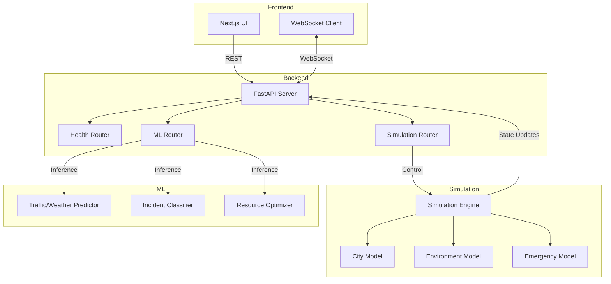
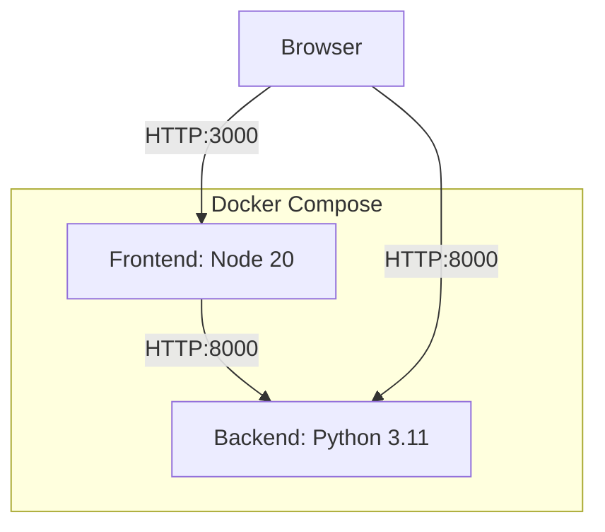

# Aureon Architecture

Aureon is an AI-powered urban digital twin platform consisting of four main subsystems: Frontend, Backend, ML, and Simulation.

## System Architecture

## Docker Deployment Architecture

Aureon uses Docker Compose for local development and deployment.

## Data Flow (Simulation → ML → Backend → Frontend)

1. **Simulation Engine** generates urban states (e.g., traffic conditions, weather events, emergencies) continuously.
2. **Backend API** receives these states or reads them from the simulation process.
3. **ML Models** process the simulation data (e.g., predicting traffic flow, classifying incidents, optimizing emergency response routing).
4. **Backend API** aggregates the simulated state and ML insights.
5. **Frontend UI** requests the aggregated data via REST or receives real-time streams via WebSocket.

## Models

### Simulation Models
- **Environment**: Simulates weather, temperature, and environmental conditions.
- **City**: Simulates traffic flow, crowd movement, and urban infrastructure.
- **Emergency**: Simulates random or triggered events like accidents, fires, and medical emergencies.

### ML Models
- **Classifier**: Categorizes incidents based on severity, type, and required response.
- **Predictor**: Forecasts future states (e.g., traffic bottlenecks in the next 30 minutes).
- **Optimizer**: Suggests optimal resource allocation (e.g., routing ambulances, adjusting traffic lights).

## API Layer

The backend uses FastAPI to expose three main route groups:
1. **Health (`/api/v1/health`)**: System status and dependency checks.
2. **Simulation (`/api/v1/simulations`)**: Endpoints to start, stop, configure, and monitor digital twin runs.
3. **ML (`/api/v1/models`)**: Endpoints to list models, retrieve metadata, and run inferences against simulation states.
